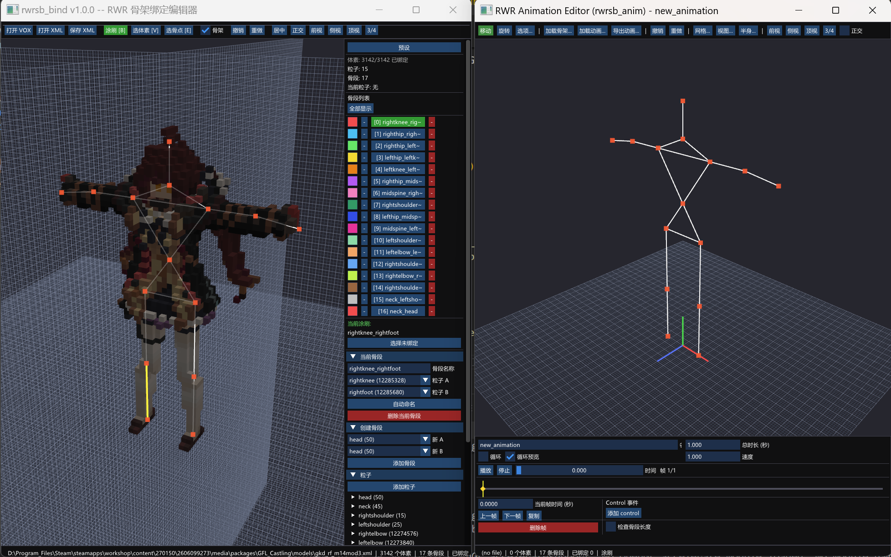

# RWRSB - rwrsb_bind + rwrsb_anim

> [中文版](README.md)

`rwrsb_bind` is a voxel skeleton binding editor for RWR-style assets.

It loads `.vox` files or project XML directly, lets you edit the skeleton structure and voxel binding relationships, and exports back to the target XML format. The focus of the current version is "practical skeleton editing and reuse", not just re-binding points on the default humanoid skeleton.



## Feature Overview

- Load MagicaVoxel `.vox` files
- Load project-compatible XML
- Edit `particle` nodes
- Edit `stick` connections
- Re-bind voxels to skeleton segments
- Save and reuse skeleton presets
- Drag particles directly in the viewport
- Grid display, major/minor grid, and grid snapping
- Chinese / English bilingual UI
- UI scaling
- Camera Y-axis inversion
- Export to XML

## Requirements

- Windows
- Python 3.10+
- Working OpenGL drivers

Main dependencies:

- `moderngl`
- `glfw`
- `imgui[glfw]`
- `numpy`

## Quick Start

First-time environment setup:

```bat
setup.bat
```

Launch the editor:

```bat
run.bat
```

Or run directly:

```bat
.venv\Scripts\python main.py
```

To open a file on launch:

```bat
.venv\Scripts\python main.py path\to\model.vox
```

## Animation Editor (rwrsb_anim.exe)

`rwrsb_anim` is the second tool in this repository, used for creating and modifying RWR soldier XML animations.

Launch command:

```bat
.venv\Scripts\python main_animation.py
```

### Startup Behavior

On launch, the tool automatically loads the built-in vanilla humanoid skeleton (15 particles) and enters an empty animation editing mode — you can start keyframing immediately.

### Three Workflows

**A. Create from Scratch**

Drag particles to pose → add frames → adjust frame timing on the timeline → save as XML.

**B. Edit a Vanilla Animation**

Click "Load Animation" in the toolbar → select `soldier_animations.xml` → choose `walking` (or any other animation) → edit frames → save.

**C. Custom Skeleton**

Click "Open Skeleton" in the toolbar → select a custom skeleton XML (must have exactly 15 particles) → create or load an animation → edit → save.

You can also drag an XML file directly onto the window; the tool will automatically detect whether it is a skeleton file or an animation file.

### File Compatibility

- Output XML is compatible with `soldier_animations.xml` and can be read directly by the RWR engine.
- Animation XML exported by `rwrac.exe` can be loaded as input (note that rwrac's particle name fields usually have a `.dae` suffix; the animation data is usable, but any logic that depends on particle names will need to be corrected manually).

### Grid Snapping

The "Grid..." button in the toolbar toggles the viewport grid and particle drag snapping. Supports step sizes of 0.5, 1, or a custom value. The three planes (XZ / XY / YZ) can be toggled independently.

### Stick Length Check

The "Check stick lengths" checkbox in the lower-right of the animation panel enables real-time display of sticks whose length deviates from the frame-0 reference length by more than the configured threshold, highlighted in red in the viewport. The default threshold is 1% (matching the natural drift in vanilla animations).

### Planned

- Mixamo animation import (the "Import Mixamo" toolbar button is currently disabled)

## How to Use build.bat

`build.bat` is the one-click packaging script for the project. It produces a Windows distributable directory.

Run it with:

```bat
build.bat
```

It automatically:

1. Checks whether `.venv` exists
2. Activates the virtual environment
3. Installs `PyInstaller` if missing
4. Deletes old `build/` and `dist/` directories
5. Rebuilds the release package using [rwrsb_bind.spec](rwrsb_bind.spec)

After a successful build, the output is at:

```text
dist\rwrsb_bind\rwrsb_bind.exe
```

When distributing, it is recommended to zip the entire `dist\rwrsb_bind` folder rather than just the exe, because the directory also contains:

- PyInstaller runtime files
- `shaders/`
- `presets/`
- `glfw3.dll` and other bundled resources

## Editing Workflow

1. Open a `.vox` or `.xml` file
2. Inspect or edit the skeleton in the right panel
3. Add, modify, or delete `particle` / `stick` entries
4. Use `brush` or `select` for voxel binding
5. Drag particles in the viewport to fine-tune the skeleton
6. Save as XML
7. Optionally save the current skeleton as a preset

## Editing Notes

- A `particle` is a skeleton node containing position and metadata.
- A `stick` connects two particles and corresponds to one binding constraint group.
- Binding relationships depend on `constraintIndex`.
- `constraintIndex` must stay consistent with the current stick order.
- When deleting or reordering sticks, the binding map must be updated in sync.
- Grid step sizes: `0.5`, `1`, or any positive integer in voxels.
- Grid planes can be enabled individually: `XZ / XY / YZ`.
- Viewport particle dragging supports axis constraints:
  - `Shift`: lock X
  - `Ctrl`: lock Y
  - `Alt`: lock Z

## Project Structure

- `main.py`
  - Entry point for the binding tool (`rwrsb_bind.exe`)
  - GLFW window lifecycle
  - Input events
  - Viewport drag
  - UI logic
- `main_animation.py`
  - Entry point for the animation tool (`rwrsb_anim.exe`)
  - Particle picking/dragging, drag-and-drop file loading
  - Animation playback main loop
- `animation_io.py`
  - `Animation` / `AnimationFrame` data classes
  - Soldier animation XML parsing and writing
  - Frame interpolation
- `editor_state.py`
  - Editable project state
  - Undo/Redo
  - Skeleton CRUD
  - Binding data
  - Preset CRUD
- `ui_panels.py`
  - Right-side panel and popups
  - Chinese/English bilingual strings
  - UI settings
- `renderer.py`
  - Voxel rendering
  - Skeleton rendering
  - Particle picking
  - Grid rendering
- `camera.py`
  - Orbit / Ortho camera
  - View presets
  - Ray construction
- `xml_io.py`
  - `.vox` parsing
  - XML parsing
  - XML writing
  - Coordinate conversion
- `resource_utils.py`
  - Unified resource path resolution
  - Compatibility between source and PyInstaller builds
- `presets/`
  - Skeleton preset JSON files
- `shaders/`
  - GLSL shaders

## XML Data Model

The XML workflow revolves around three data blocks:

- `voxels` — voxel positions and colors
- `skeleton`
  - `particle`
  - `stick`
- `skeletonVoxelBindings`
  - `group constraintIndex="..."`
  - Voxel indices belonging to a given stick group

Key constraints:

- Particle IDs must be unique.
- Both ends of a stick must reference existing particles.
- `group.constraintIndex` must equal the stick's list index.
- After editing the skeleton, the correct binding relationships must be preserved on export.

## Presets

Skeleton presets are stored as JSON files under `presets/`.

The repository currently ships with:

- `human_skeleton.json`
- `88.json`

Presets only store the skeleton structure:

- particles
- sticks

Voxel bindings are project-specific data and are not part of a preset.

## Developer Notes

- On a new machine, run `setup.bat` first.
- `.venv/` is local-only; do not commit it.
- Do not commit `__pycache__/`.
- If you change parsing or export logic, test at least one `.vox` and one `.xml` round-trip.
- Coordinate conversion changes are especially risky — they affect both import and export.
- Stick deletion and reordering are the most common sources of binding corruption; test carefully.

## Notes for AI Continuators

If you need to extend this project, read these first:

- [main.py](main.py)
- [editor_state.py](editor_state.py)
- [xml_io.py](xml_io.py)
- [ui_panels.py](ui_panels.py)

Recommended module boundaries:

- `editor_state.py` — state and business rules
- `renderer.py` — rendering and picking
- `ui_panels.py` — UI calls only; do not re-implement business logic here
- `xml_io.py` — file format parsing and writing

If you change skeleton logic, always verify together:

- Viewport dragging
- Panel editing
- Preset save/load
- Undo/redo
- XML export
- Binding remap after stick deletion

## Git Hygiene

The repository ignores these local artifacts:

```gitignore
.venv/
__pycache__/
*.py[cod]
build/
dist/
```

If these files are accidentally tracked later, remove them from the Git index rather than deleting the local files.

## Releases

Release process: see [RELEASE_EN.md](RELEASE_EN.md).

Release notes: see [RELEASE_NOTES_v1.0.0_EN.md](RELEASE_NOTES_v1.0.0_EN.md).

## Known Limitations

- Final runtime behavior should still be verified in a local OpenGL environment.
- Current XML compatibility targets this project's format, not an arbitrary generic schema.
- The current distribution is a directory package, not a single-file exe.

## License

This project is licensed under the MIT License. See [LICENSE](LICENSE) for details.
